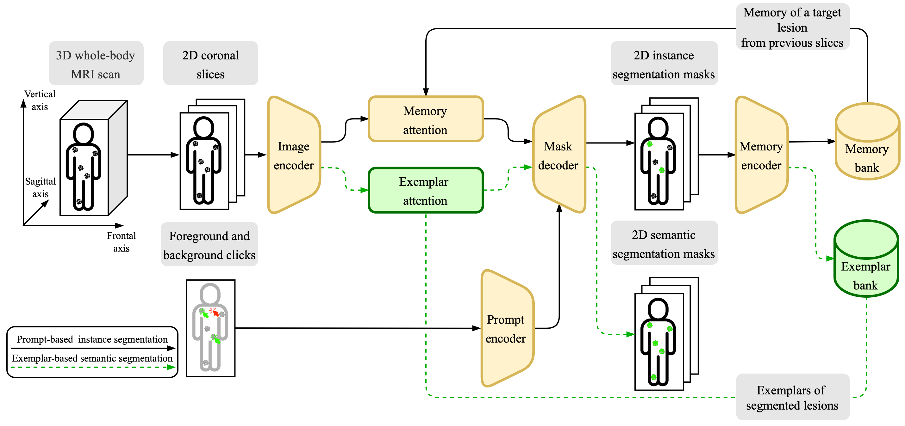
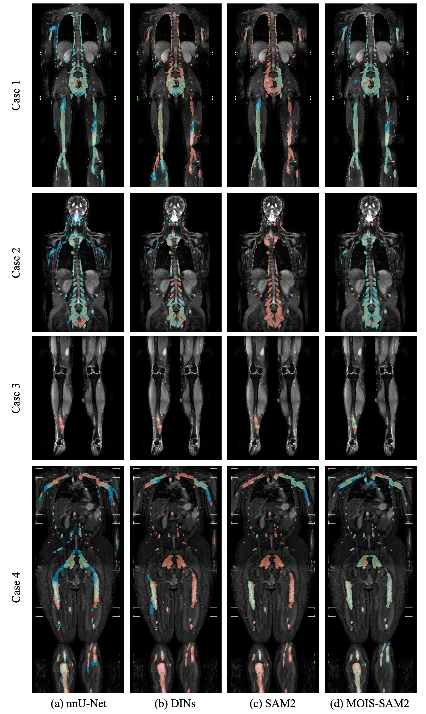

# MOIS-SAM2: Exemplar-Based SAM2 for Multi-Lesion Interactive Segmentation of Neurofibromas in Whole-Body MRI

**Authors:** Georgii Kolokolnikov, Marie-Lena Schmalhofer, Lennart Well, Said Farschtschi, Victor-Felix Mautner, Inka Ristow, and René Werner  
University Medical Center Hamburg-Eppendorf, 20246 Hamburg, Germany

---

## Overview

### Background and Objectives

Neurofibromatosis type 1 is a genetic disorder characterized by the development of numerous neurofibromas (NFs) throughout the body. Whole-body MRI (WB-MRI) is the clinical standard for longitudinal surveillance of NFs; however, manual segmentation of these lesions is labor-intensive. Existing interactive segmentation methods fail to combine high lesion-wise precision with scalability to hundreds of lesions. This study proposes a novel interactive segmentation model tailored to this challenge

### Methods

We introduce **MOIS-SAM2** – a multi-object interactive segmentation model that extends the state-of-the-art, transformer-based, promptable Segment Anything Model 2 (SAM2) with exemplar-based semantic propagation. The model uses user prompts to segment a small set of lesions and propagates this knowledge to similar, unprompted lesions throughout the scan.




### Evaluated Models

We evaluated and benchmarked the following interactive segmentation models:

- **[nnU-Net](https://github.com/MIC-DKFZ/nnUNet)** – Automated segmentation using CNN-based model.
- **[DINs (Deep Interactive Networks)](https://github.com/Jarvis73/DINs/tree/main)** – Interactive CNN-based model incorporating user feedback.
- **[SW-FastEdit (Sliding Window FastEdit)](https://github.com/Zrrr1997/SW-FastEdit)** – Interactive CNN-based model with a sliding window strategy.
- **[SAM2 (Segment Anything Model 2)](https://github.com/facebookresearch/sam2/tree/main)** – Interactive transformer-based model extending 2D segmentation into videos.
- **[VISTA3D (Versatile Imaging Segmentation and Annotation in 3D)](https://github.com/facebookresearch/sam2/tree/main)** - State-of-the-art interactive segmentation transformer-based model.
- **[MOIS-SAM2 (Multi-Object Interactive Segmentation extension of Segment Anything Model 2)](https://github.com/IPMI-ICNS-UKE/MOIS_SAM2_NF)** – Our proposed interactive segmentation model that supports exemplar-based semantic propagation to unprompted lesions.

The figure below presents qualitative comparison of segmentation results from MOIS-SAM2 and three baseline models across four representative test cases. Each row corresponds to a single patient case, and each column to a respective model: (a) nnU-Net (automated convolution-based), (b) DINs (interactive convolution-based), (c) SAM2 (interactive transformer-based), and (d) MOIS-SAM2 (proposed). Cases: (1) in-domain, (2) MRI field strength variation, (3) low tumor burden, (4) clinical site and scanner vendor variation. True positives are shown in green, false positives in blue, and false negatives in red. Evaluation used 20 prompted lesions and 3 simulated user clicks per lesion:




### Project Structure

The key directories of this repository:

- `model_code/mois_sam2_nf/` – Code of the Multi-Object Interacactive Segmentation extension of SAM2 (model, training and inference logic).
- `launchers/` – Launcher scripts for fine-tuning the benchmarking models, e.g., DINs, SW-FastEdit, SAM2.
- `evaluation/` – Evaluation pipeline for interactive segmentation models.
- `monai_label_app/` – Proposed MOIS-SAM2 model integrated into MONAI Label App, so that it can be used within 3D Slicer.

---

## Setup and Installation

### Clone the Repository
```bash
git clone https://github.com/IPMI-ICNS-UKE/MOIS_SAM2_NF.git
cd MOIS_SAM2_NF
```

### Environment Setup

There are two environments:
1. **PyTorch-based** (for evaluation pipeline, training of most models, including MOIS-SAM2, and interactive segmentation pipeline in MONAI Label app)
2. **TensorFlow-based** (for training and model weights exporting of DINs)

#### PyTorch Environment
```bash
conda env create -f environment_torch.yml
conda activate nf_iseg_benchmark_torch
```
Then install **SAM2**:
```bash
cd model_code/mois_sam2_nf
pip install -e .
pip install -e ".[dev]"
```
Install additional packages:
```bash
pip install git+https://github.com/cheind/py-thin-plate-spline
```

#### TensorFlow Environment (for DINs training and exporting only)
```bash
conda env create -f environment_tf.yml
conda activate nf_iseg_benchmark_tf
pip install git+https://github.com/IDSIA/sacred.git@0.8.3
```

---

## Usage

### Data Preparation

The repository was developed for and tested with **3D whole-body MRI** scans in `.nii.gz` format. Potentially, it can also work with other 3D data in .nii.gz format, however some adjustments could be required.

1. Place the original dataset in `data/raw/`, following the structure:
   - `imagesTr/`
   - `labelsTr_instance/`
   - `imagesTs/`
   - `labelsTs_instance/`

   Refer to `data/raw/README.md` for further details.

2. Since transformer-based models were originally designed for 2D images, 3D images need to be sliced using:
   ```bash
   python data_scripts/convert_3d_mri_to_2d_slices.py
   ```

3. To split data into training and validation sets:
   ```bash
   python data_scripts/split_into_train_val_sets.py
   ```

### Getting Pre-Trained Model Weights

Pre-trained models should be downloaded and placed in `model_weights/` following the structure in `model_weights/README.md`.

MOIS-SAM2 pretrained weights:
[Download from Zenodo](https://zenodo.org/records/16273967)


### Training & Fine-Tuning

Once pre-trained weights and data are set up, models can be trained/fine-tuned using the **bash scripts in `launchers/`**.

Training/Fine-Tuning Scripts:
```bash
bash launchers/finetune_dins.sh
bash launchers/finetune_sam2.sh
bash launchers/train_sw_fastedit.sh
```

To train the MOIS-SAM2 use the  **bash scripts in `model_code/mois_sam2_nf/launchers/`**. 

The progress, log files, and artifacts generated during training are dumped to `experiments/`.

**In case of the DINs model**, use the following script to export it from TensorFlow to ONNX (requires the TensorFlow environment `nf_iseg_benchmark_tf`):
```bash
python model_weights/convert_tf_onnx.py
```

**In case of the SAM2 model**, please export the model weights from the checkpoint:
```bash
python model_weights/export_sam2_model_weights.py
```

Once a model is trained, the final model weights should be placed to `model_weights_finetuned/`, according to `model_weights_finetuned/README.md`.


### Model Evaluation

To evaluate trained models, navigate to `evaluation/experiment_launchers/` and execute the respective bash scripts inside, for example:
```bash
cd evaluation/experiment_launchers
bash launch_SAM2_lesion_wise_corrective.sh
```

The evaluation results (metrics, predictions) are saved in `evaluation/results/`.

### Analyze Evaluation Results
Results can be analyzed using Jupyter notebooks in `results/`:
```bash
cd results
jupyter notebook result_analysis.ipynb
```


---

## Notes and Disclaimer
- Ensure all **paths are correctly configured** according to your local setup.
- This repository was tested with **3D whole-body MRI (.nii.gz)** images. Other 3D medical imaging data may require spatial adjustments.
- Any **modifications to training configurations** can be made in the **bash scripts inside `launchers/`**.
- Any **modifications to evaluation configurations** can be made in the **bash scripts inside `evaluation/experiment_launchers`**.

---
## Acknowledgement

We would like to thank all the authors of the following repositories and respective research papers that were instrumental in our work:
- [MONAI Label](https://github.com/Project-MONAI/MONAILabel); Diaz-Pinto et al. (2022), [arXiv preprint](https://arxiv.org/pdf/2203.12362.pdf)
- [nnU-Net: a self-configuring method for deep learning-based biomedical image segmentation](https://github.com/MIC-DKFZ/nnUNet); Isensee et al. (2021), [Nature Methods](https://www.nature.com/articles/s41592-020-01008-z)
- [DINs: Deep Interactive Networks for Neurofibroma Segmentation in Neurofibromatosis Type 1 on Whole-Body MRI](https://github.com/Jarvis73/DINs/tree/main); Zhang et al. (2022), [IEEE Journal of Biomedical and Health Informatics](https://doi.org/10.1109/JBHI.2021.3087735)
- [Sliding Window Fastedit: A Framework for Lesion Annotation in Whole-Body Pet Images](https://github.com/Zrrr1997/SW-FastEdit); Hadlich et al. (2024), [IEEE ISBI](https://doi.org/10.1109/ISBI56570.2024.10635459)
- [SAM 2: Segment Anything in Images and Videos](https://github.com/facebookresearch/sam2/tree/main); Ravi et al. (2024), [arXiv preprint](https://arxiv.org/abs/2408.00714)
- [VISTA3D: Versatile Imaging SegmenTation and Annotation model for 3D Computed Tomography](https://github.com/Project-MONAI/VISTA/tree/main/vista3d); He et al. (2024), [arXiv preprint](https://arxiv.org/abs/2406.05285)


---

## Contact
For questions, feedback, or collaboration inquiries, please contact:
- [Georgii Kolokolnikov](mailto:g.kolokolnikov@uke.de)
- [Institute for Applied Medical Informatics](https://www.uke.de/english/departments-institutes/institutes/applied-medical-informatics/index.html)

For technical issues or feature requests, please open an issue in this repository’s [Issues section](https://github.com/IPMI-ICNS-UKE/MOIS_SAM2_NF/issues).
