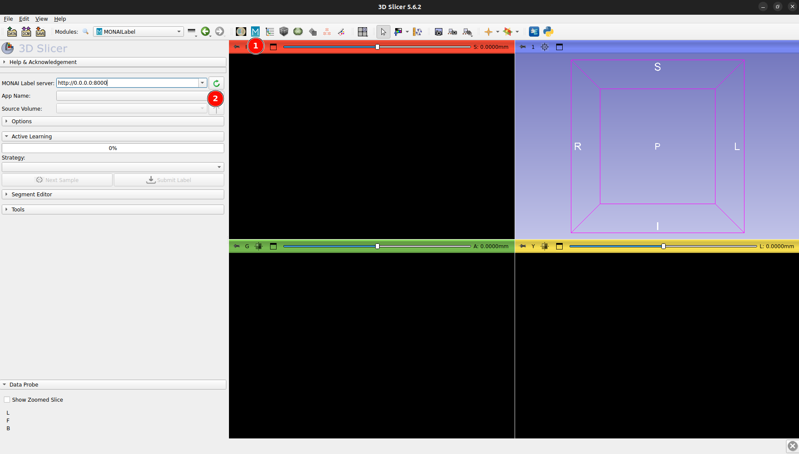
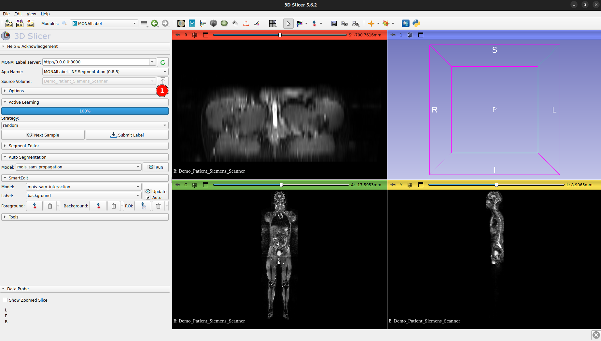
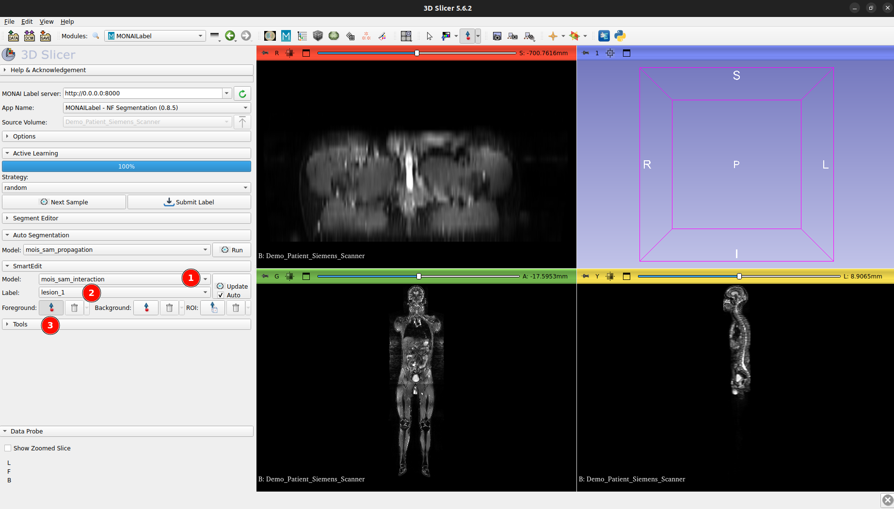
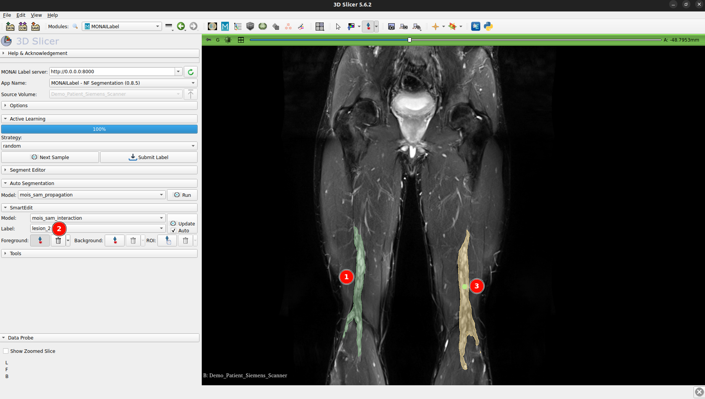
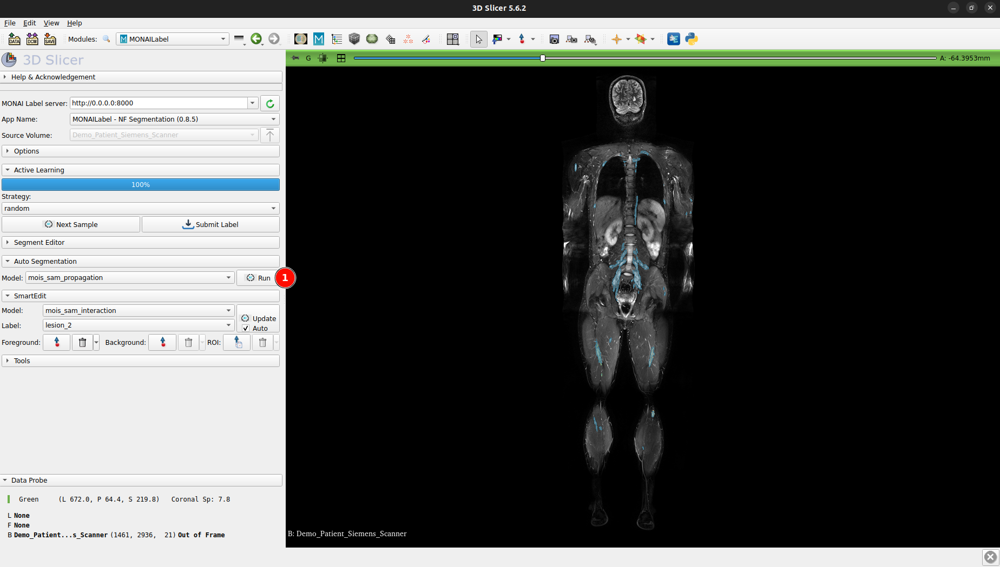
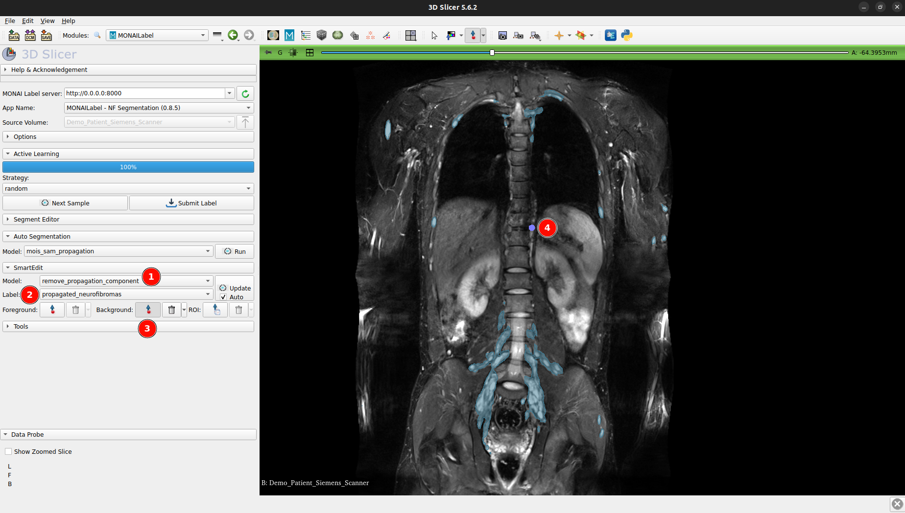

# Interactive Segmentation Pipeline for Neurofibromas in Whole-Body MRI

---

## Overview

This repository provides a multi-object interactive segmentation pipeline for neurofibroma (NF) segmentation in T2-weighted fat-suppressed whole-body MRI (WB-MRI). Inspired by the [Radiology Sample App from MONAI Label](https://github.com/Project-MONAI/MONAILabel/tree/main/sample-apps/radiology), the pipeline integrates seamlessly with [3D Slicer](https://www.slicer.org/), enabling user-friendly interaction and future extensibility.

The backend is a MONAI Label server implementing all segmentation logic. It is recommended to run it on a GPU-equipped workstation or cluster. [3D Slicer](https://www.slicer.org/) can be used on the client side to access the backend server and interactively guide the segmentation.

---

## Functionality

The pipeline provides the following interactive segmentation modes:

- **Interactive instance segmentation**: Segments a single lesion based on user-provided positive and negative clicks (mode: `mois_sam_interaction`). Each prompted lesion is added to the exemplar bank.
- **Exemplar-based semantic propagation**: Segments all lesions in the WB-MRI using accumulated exemplars (mode: `mois_sam_propagation`).
- **Propagation component removal**: Removes individual false-positive components from the propagated segmentation using negative clicks (mode: `remove_propagation_component`).

---

## Setup

### Server-Side

1. Clone the repository and create the environment:

   ```bash
   git clone https://github.com/IPMI-ICNS-UKE/MOIS_SAM2_NF.git
   conda env create -f environment_torch.yml -n nf_iseg_benchmark_torch
   ```

2. Download and set up model weights ([Zenodo](https://zenodo.org/records/16273967)):

   ```bash
   cd MOIS_SAM2_NF/monai_label_app/nf_segmentation_app/model/
   mkdir MOIS_SAM2
   cd MOIS_SAM2
   wget https://zenodo.org/records/16273967/files/model.zip
   unzip model.zip && rm model.zip
   ```

### Client-Side
1. Install [3D Slicer](https://www.slicer.org/).
2. Install the MONAI Label Plugin in 3D Slicer following [these instructions](https://github.com/Project-MONAI/MONAILabel/tree/main/plugins/slicer).

---

## Usage
<details>
<summary><strong>Server-Side</strong></summary>

1. Activate the environment:
   ```bash
   conda activate nf_iseg_benchmark_torch
   ```

2. Launch the MONAI Label server:
   ```bash
   bash launch_nf_segmentation_server.sh
   ```

[More command-line options](https://github.com/Project-MONAI/MONAILabel/tree/main?tab=readme-ov-file#step-5-start-monai-label-server-and-start-annotating)

</details>


<details>
<summary>Client-side</summary>

1. Launch 3D Slicer and connect to the MONAI Label server. <details> <summary>Expand for visual instructions</summary>
   <p>
     
   </p>
   </details>
2. Upload MRI data to the MONAI Label server. <details> <summary>Expand for visual instructions</summary>
   <p>
     
   </p>
   </details>
3. Select the interactive instance segmentation mode, choose the lesion label, and activate the foreground click mode. <details> <summary>Expand for visual instructions</summary>
   <p>
     
   </p>
   </details>
4. Click on a neurofibroma. After annotating one lesion, switch to the next lesion label and annotate the next neurofibroma. <details> <summary>Expand for visual instructions</summary>
   <p>
     
   </p>
   </details>
5. After annotating 5-10 lesions, launch exemplar-based semantic propagation to segment all neurofibromas in the scan.<details> <summary>Expand for visual instructions</summary>
   <p>
     
   </p>
   </details>
6. If the propagated segmentation has false positives, activate propagation component removal tool, choose the label for  **propagated neurofibromas**, activate the background click mode, and remove false positive components slice-by-slice. <details> <summary>Expand for visual instructions</summary>
   <p>
     
   </p>
   </details>   


</details>

---

## Contact
For questions, feedback, or collaboration inquiries, please contact:
- [Georgii Kolokolnikov](mailto:g.kolokolnikov@uke.de)
- [Institute for Applied Medical Informatics](https://www.uke.de/english/departments-institutes/institutes/applied-medical-informatics/index.html)

For technical issues or feature requests, please open an issue in this repository’s [Issues section](https://github.com/IPMI-ICNS-UKE/MOIS_SAM2_NF/issues).

